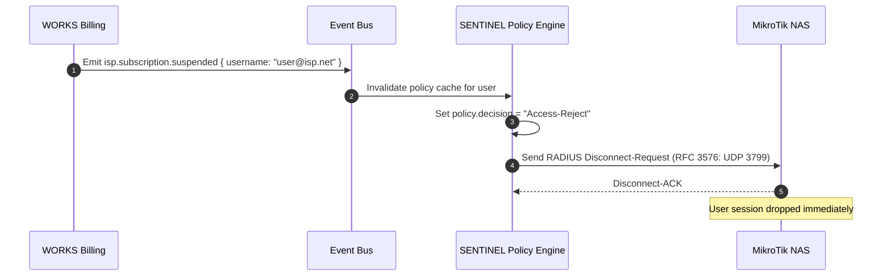

# Design: ISP Integration Phase 1 — Synchronize WORKS Entitlement with SENTINEL Access Policy (Issue #13)

## 1. Event Propagation Sequence

```mermaid
sequenceDiagram
    autonumber
    participant WORKS as WORKS Billing
    participant Bus as Event Bus
    participant SENTINEL as SENTINEL Policy Engine
    participant NAS as MikroTik NAS

    WORKS->>Bus: Emit isp.subscription.suspended { username: "user@isp.net" }
    Bus->>SENTINEL: Invalidate policy cache for user
    SENTINEL->>SENTINEL: Set policy.decision = "Access-Reject"
    SENTINEL->>NAS: Send RADIUS Disconnect-Request (RFC 3576: UDP 3799)
    NAS-->>SENTINEL: Disconnect-ACK
    Note over NAS: User session dropped immediately
```

