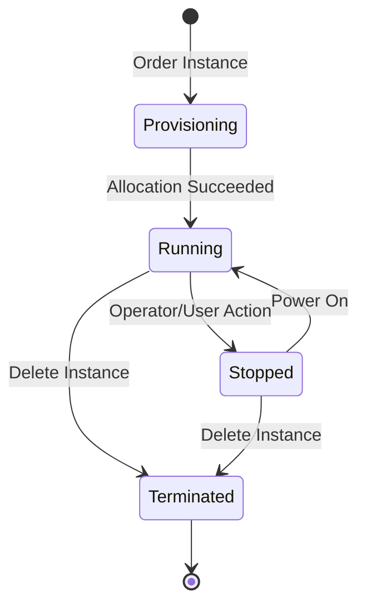

# Design: ORBIT Phase 1 — Cloud Compute & Hosting Customer Experience

## 1. Instance Lifecycle State Machine

```mermaid
stateDiagram-v2
    [*] --> Provisioning : Order Instance
    Provisioning --> Running : Allocation Succeeded
    Running --> Stopped : Operator/User Action
    Stopped --> Running : Power On
    Running --> Terminated : Delete Instance
    Stopped --> Terminated : Delete Instance
    Terminated --> [*]
```

