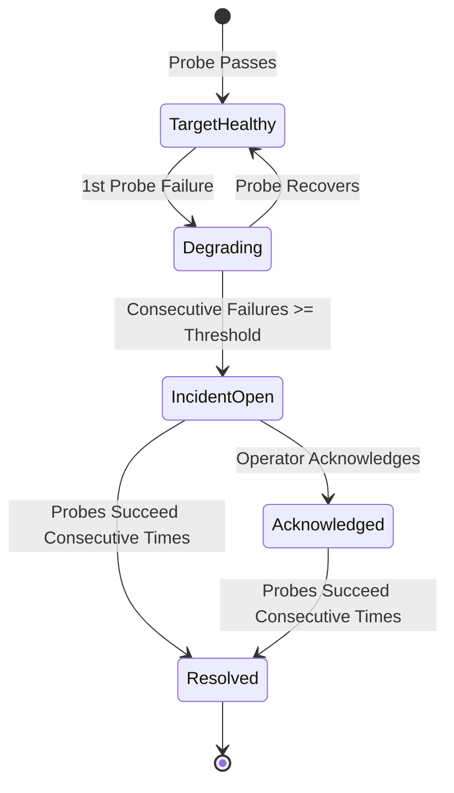

# Design: WATCHTOWER Phase 1 — Monitoring Targets, Probes, Alerts & Incidents (Issue #17)

## 1. Incident Lifecycle State Diagram

```mermaid
stateDiagram-v2
    [*] --> TargetHealthy : Probe Passes
    TargetHealthy --> Degrading : 1st Probe Failure
    Degrading --> IncidentOpen : Consecutive Failures >= Threshold
    Degrading --> TargetHealthy : Probe Recovers
    IncidentOpen --> Acknowledged : Operator Acknowledges
    IncidentOpen --> Resolved : Probes Succeed Consecutive Times
    Acknowledged --> Resolved : Probes Succeed Consecutive Times
    Resolved --> [*]
```

