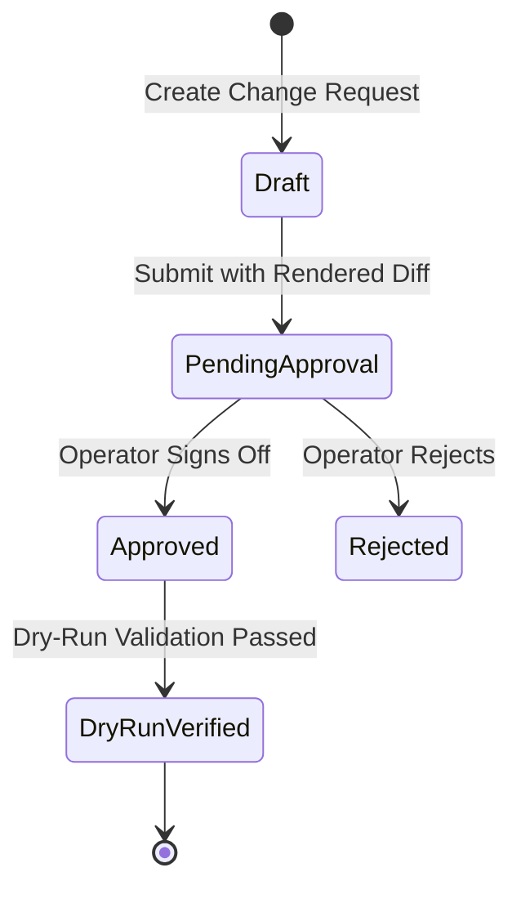

# Design: FORGE Phase 1 — Safe Network Configuration Templates & Approval Foundation (Issue #18)

## 1. Approval Workflow State Diagram

```mermaid
stateDiagram-v2
    [*] --> Draft : Create Change Request
    Draft --> PendingApproval : Submit with Rendered Diff
    PendingApproval --> Approved : Operator Signs Off
    PendingApproval --> Rejected : Operator Rejects
    Approved --> DryRunVerified : Dry-Run Validation Passed
    DryRunVerified --> [*]
```

