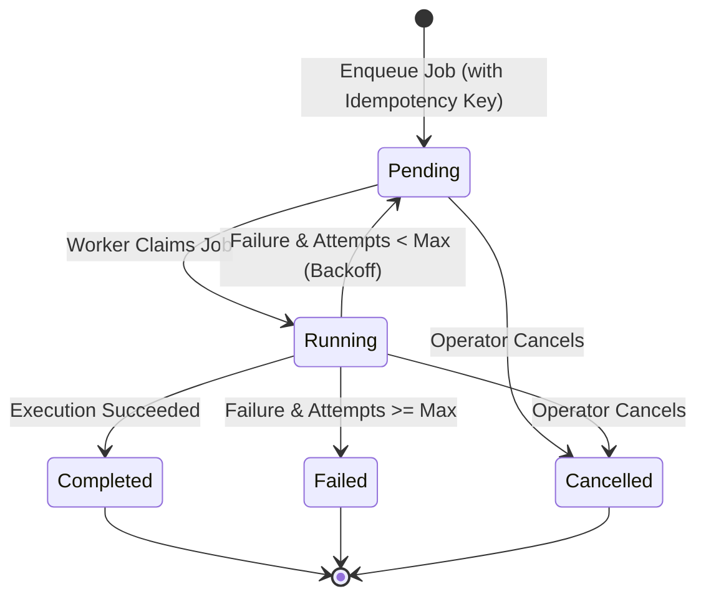

# Design: PULSE Phase 1 — Network Operation Job Lifecycle (Issue #19)

## 1. Job State Transition Model

```mermaid
stateDiagram-v2
    [*] --> Pending : Enqueue Job (with Idempotency Key)
    Pending --> Running : Worker Claims Job
    Running --> Completed : Execution Succeeded
    Running --> Pending : Failure & Attempts < Max (Backoff)
    Running --> Failed : Failure & Attempts >= Max
    Pending --> Cancelled : Operator Cancels
    Running --> Cancelled : Operator Cancels
    Completed --> [*]
    Failed --> [*]
    Cancelled --> [*]
```

