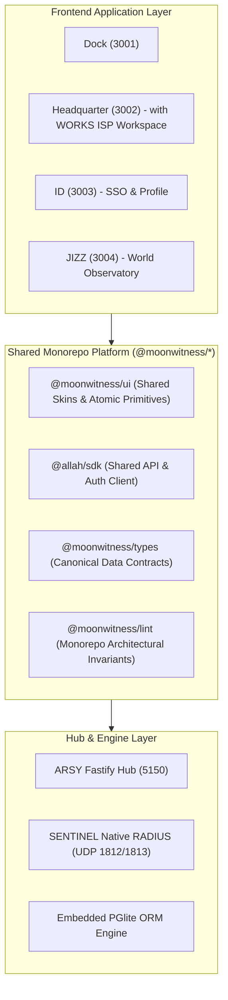

# Design: Ecosystem Architecture Phase 1 — Product Application Boundaries & Naming Canon (Issue #21)

## 1. Application Layering & Cross-Cutting Architecture

```mermaid
graph TD
    subgraph ClientLayer["Frontend Application Layer"]
        Dock["Dock (3001)"]
        HQ["Headquarter (3002) - with WORKS ISP Workspace"]
        ID["ID (3003) - SSO & Profile"]
        JIZZ["JIZZ (3004) - World Observatory"]
    end

    subgraph PlatformLayer["Shared Monorepo Platform (@moonwitness/*)"]
        UI["@moonwitness/ui (Shared Skins & Atomic Primitives)"]
        SDK["@allah/sdk (Shared API & Auth Client)"]
        Types["@moonwitness/types (Canonical Data Contracts)"]
        Lint["@moonwitness/lint (Monorepo Architectural Invariants)"]
    end

    subgraph ServiceLayer["Hub & Engine Layer"]
        Arsy["ARSY Fastify Hub (5150)"]
        Sentinel["SENTINEL Native RADIUS (UDP 1812/1813)"]
        PGlite["Embedded PGlite ORM Engine"]
    end

    ClientLayer --> PlatformLayer
    PlatformLayer --> ServiceLayer
```
